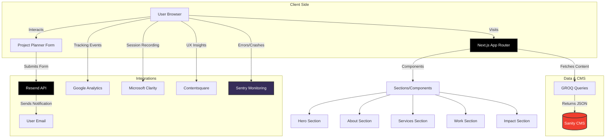

# Shift2Dynamic | Enterprise Shopify Solutions


[](https://github.com/siraajul/Shopifolio/actions/workflows/playwright.yml)


**Where High-Performance Engineering meets Aesthetic Dominance.**

Shift2Dynamic is a premium digital agency codebase designed for **outcome-based** Shopify solutions. We don't just build stores; we engineer 7-figure digital ecosystems using bleeding-edge technology.

---

## ⚡ The "Heavy Hitter" Tech Stack

Built for speed, scalability, reliability, and "wow" factor.

*   **Core**: [Next.js 15](https://nextjs.org/) (App Router)
*   **Language**: [TypeScript](https://www.typescriptlang.org/)
*   **Styling**: [Tailwind CSS v4](https://tailwindcss.com/)
*   **CMS**: [Sanity.io](https://www.sanity.io/) (Headless Content Management)
*   **Motion**: `framer-motion` + `lenis` (Smooth Scroll)
*   **Email**: [Resend](https://resend.com/) + React Email
*   **Monitoring**: [Sentry](https://sentry.io/) (Real-time Crash Reporting)
*   **Testing**: [Playwright](https://playwright.dev/) (Visual & E2E)
*   **Code Quality**: Husky + Lint-Staged (Automated Git Hooks)
*   **Analytics**: Google Analytics 4 + Microsoft Clarity + Contentsquare
*   **Deployment**: Vercel

---

## 🚀 Key Features

### 1. 🎨 Premium "Dark Mode" Aesthetic
*   **Cinematic Noise Overlay**: Eliminates the "flat digital" look.
*   **Neon/Toxic Green Aesthetic**: Custom `oklch` palette.
*   **3D Gallery**: Interactive, centered image showcase.
*   **Typography**: `Syne` (Display) + `Manrope` (Body).

### 2. 🛡️ Enterprise-Grade Reliability
*   **Visual Regression Testing**: Automated "Golden Snapshot" comparisons to detect pixel-level UI regressions.
*   **Real-time Monitoring**: Sentry Integration captures production crashes and performance bottlenecks instantly.
*   **CI/CD Pipeline**: Automated testing and build verification on every push.

### 3. 📋 Intelligent Project Planner
A dedicated multi-step form (`/planner`) that adapts to the client:
*   **Dynamic Logic**: Questions change based on "Migration", "Redesign", or "Marketing" selection.
*   **Phone capture**: Integrated into contact step.
*   **Email Notifications**: Styled HTML emails sent via Resend API.

### 4. 📊 Full Analytics Suite
*   **Google Analytics 4**: Tracks conversions (`generate_lead`).
*   **Microsoft Clarity**: Session recordings & heatmaps.
*   **Contentsquare**: Enterprise UX insights.

### 5. 🤖 GEO & SEO Optimized (Generative Engine Optimization)
*   **AI-Native Metadata**: Optimized for LLMs (Gemini, ChatGPT, Perplexity) with "Entity-First" keywords and descriptions.
*   **Rich Schema Markup**: Comprehensive `Organization` and `Service` JSON-LD schema to build a Knowledge Graph.
*   **Semantic HTML**: Strict `<h1>` hierarchy and semantic tag usage for perfect accessibility and crawlability.
*   **Auto-generated Sitemap**: Dynamic `/sitemap.xml` with prioritization strategies.
*   **Robots.txt**: configured for optimal crawler access.
*   **OpenGraph**: Unique social sharing cards for every page (`/work`, `/planner`, etc.).

### 6. 🛡️ Hygiene & Standards
*   **Husky**: Pre-commit hooks to ensure quality.
*   **Lint-Staged**: Automatically runs `eslint --fix` on staged files.
*   **Strict Types**: Full TypeScript compliance.

---

## 🛠️ Environment Variables

To run this project with full fidelity, you need the following in your `.env.local`:

```env
# Sanity CMS
NEXT_PUBLIC_SANITY_PROJECT_ID=your_project_id
NEXT_PUBLIC_SANITY_DATASET=production

# Email (Resend)
RESEND_API_KEY=re_your_api_key

# Analytics IDs (Public)
NEXT_PUBLIC_GA_ID=G-XXXXXXXXXX
NEXT_PUBLIC_CLARITY_ID=your_clarity_id

# Sentry (Monitoring)
NEXT_PUBLIC_SENTRY_DSN=https://...
SENTRY_AUTH_TOKEN=sntry_...
```

---

## 📂 Project Structure

```
src/
├── app/
│   ├── layout.tsx       # Root (Providers, Analytics, Fonts)
│   ├── page.tsx         # Home (Sanity Data Fetching)
│   ├── planner/         # Multi-step Form Page
│   ├── work/            # Portfolio Grid Page
│   └── privacy/         # Legal Pages
├── components/
│   ├── ui/              # Shadcn Primitives (Forms, Toasts, Cards)
│   ├── sections/        # Homepage Sections (Hero, Impact, Services)
│   └── analytics/       # Tracking Scripts (Clarity, Contentsquare)
├── lib/
│   ├── email-template.tsx # React Email Component
│   └── utils.ts         # Helpers
└── sanity/              # Content Schemas
```

## 🏗️ Architecture & Data Flow



---

## 🤝 Contributing

We welcome contributions! Please read our [CONTRIBUTING.md](CONTRIBUTING.md) guide to get started with setting up the project, understanding the architecture, and submitting Pull Requests.

---

## 📄 License

Private Proprietary Software. All rights reserved.
